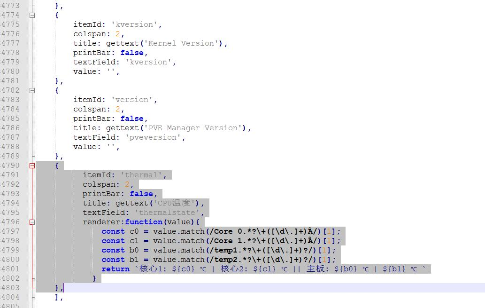
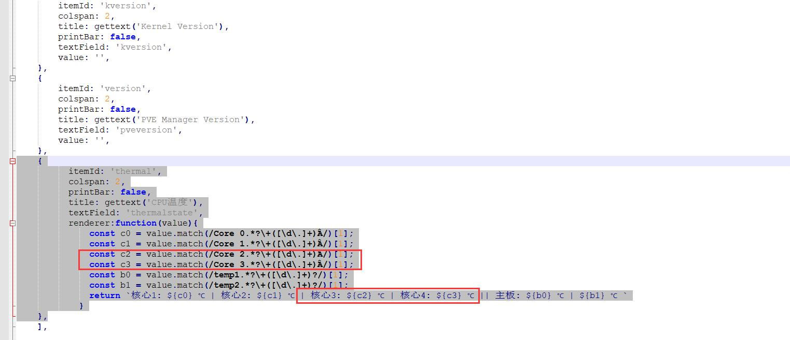
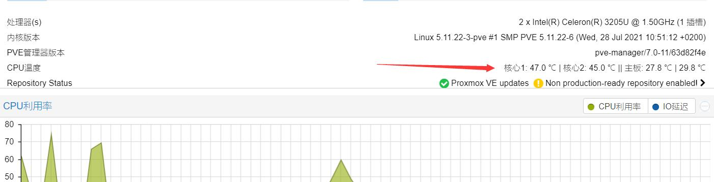

## Proxmox VE 7.0 换源

#### SSH登录到pve后台，然后一条一条的执行命令

#### 1.处理掉企业源
```
rm -rf /etc/apt/sources.list.d/pve-install-repo.list
```

```
echo "#deb https://enterprise.proxmox.com/debian/pve Bullseye pve-enterprise" > /etc/apt/sources.list.d/pve-enterprise.list
```


#### 2.开始换源

```
wget https://mirrors.ustc.edu.cn/proxmox/debian/proxmox-release-bullseye.gpg -O /etc/apt/trusted.gpg.d/proxmox-release-bullseye.gpg
```

```
echo "deb https://mirrors.ustc.edu.cn/proxmox/debian/pve bullseye pve-no-subscription" > /etc/apt/sources.list.d/pve-no-subscription.list
```
```
echo "deb https://mirrors.ustc.edu.cn/proxmox/debian/ceph-pacific bullseye main" > /etc/apt/sources.list.d/ceph.list
```

```
sed -i.bak "s#http://download.proxmox.com/debian#https://mirrors.ustc.edu.cn/proxmox/debian#g" /usr/share/perl5/PVE/CLI/pveceph.pm
```
```
sed -i.bak "s#ftp.debian.org/debian#mirrors.aliyun.com/debian#g" /etc/apt/sources.list
```
```
sed -i "s#security.debian.org#mirrors.aliyun.com/debian-security#g" /etc/apt/sources.list
```
```
echo "deb http://download.proxmox.com/debian/pve bullseye pve-no-subscription" >>  /etc/apt/sources.list
```


#### 3.最后更新
```
apt update && apt dist-upgrade -y
```


***


##  Proxmox VE 7.0 关订阅提示

#### 1.WinSCP登录到PVE，编辑打开这个文件：/usr/share/javascript/proxmox-widget-toolkit/proxmoxlib.js


#### 2.搜索'active'，找到这一段：

```
			.data.status.toLowerCase() !== 'active') {
			Ext.Msg.show({
			    title: gettext('No valid subscription'),
			    icon: Ext.Msg.WARNING,
			    message: Proxmox.Utils.getNoSubKeyHtml(res.data.url),
			    buttons: Ext.Msg.OK,
			    callback: function(btn) {
				if (btn !== 'ok') {
				    return;
				}
				orig_cmd();
			    },
			});
		    } else {
			orig_cmd();
		    }
```


#### 3.直接删掉其中几行，变成如下：

```
			.data.status.toLowerCase() !== 'active') {
				orig_cmd();
		    } else {
			orig_cmd();
		    }

```


#### 4.最后保存即可。


***


## Proxmox VE 主界面添加温度

#### 1.登录PVE的SSH，执行命令安装sensors：
```
apt-get install lm-sensors
```


#### 2.探测下温度，执行：(一路yes，回车)
```
sensors-detect
```

#### 3.获取温度信息，执行：sensors


ACPI那里是主板温度，Core0 Core1是核心温度(我只是双核，几个核心就是显示几个) 


#### 4.WinSCP登录到PVE，修改这个文件：/usr/share/perl5/PVE/API2/Nodes.pm 

(我习惯于下载到本地用Notepad++修改)

搜索：
```
$res->{pveversion} = PVE::pvecfg::package()
```

在这个定义的下方添加：
```
$res->{thermalstate} = `sensors`;
```

结果如图：


修改完保存，然后塞回路径。


#### 5.修改这个文件：/usr/share/pve-manager/js/pvemanagerlib.js (建议备份，万一自己改炸就不好了。)

(我习惯于下载到本地用Notepad++修改)

搜索PVE Manager Version


在这个定义的下方添加一个定义：

```
	{
          itemId: 'thermal',
          colspan: 2,
          printBar: false,
          title: gettext('CPU温度'),
          textField: 'thermalstate',
          renderer:function(value){
              const p0 = value.match(/Package id 0.*?\+([\d\.]+)Â/)[1];
              const c0 = value.match(/Core 0.*?\+([\d\.]+)Â/)[1];
              const c1 = value.match(/Core 1.*?\+([\d\.]+)Â/)[1];
              const b0 = value.match(/temp1.*?\+([\d\.]+)?/)[1];
              const b1 = value.match(/temp2.*?\+([\d\.]+)?/)[1];
              return `Package: ${p0} ℃ || 核心1: ${c0} ℃ | 核心2: ${c1} ℃ || 主板: ${b0} ℃ | ${b1} ℃ `
            }
    },
```

结果如图：


因为我是双核心，所以只写了2个核心的温度参数。


如果是四核心的就是这样：

```         
	{
          itemId: 'thermal',
          colspan: 2,
          printBar: false,
          title: gettext('CPU温度'),
          textField: 'thermalstate',
          renderer:function(value){
              const p0 = value.match(/Package id 0.*?\+([\d\.]+)Â/)[1];
              const c0 = value.match(/Core 0.*?\+([\d\.]+)Â/)[1];
              const c1 = value.match(/Core 1.*?\+([\d\.]+)Â/)[1];
              const c2 = value.match(/Core 2.*?\+([\d\.]+)Â/)[1];
              const c3 = value.match(/Core 3.*?\+([\d\.]+)Â/)[1];
              const b0 = value.match(/temp1.*?\+([\d\.]+)?/)[1];
              const b1 = value.match(/temp2.*?\+([\d\.]+)?/)[1];
              return `Package: ${p0} ℃ || 核心1: ${c0} ℃ | 核心2: ${c1} ℃ | 核心3: ${c2} ℃ | 核心4: ${c3} ℃ || 主板: ${b0} ℃ | ${b1} ℃ `
            }
    },	  
```

结果如图：




增加核心增加参数：const c2/const c3，下面显示参数也要加：核心3: ${c2} ℃ | 核心4: ${c3} ℃ 。所以自己设备几个核心，按需修改。

修改完保存，然后塞回路径。


#### 改完重启界面：systemctl restart pveproxy ，重进PVE主页，就看到温度显示了。




